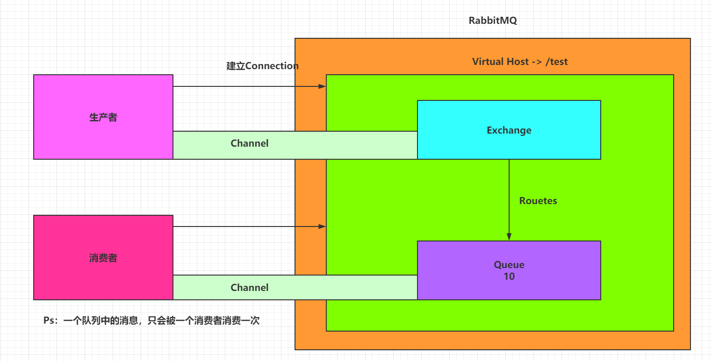

一、整体架构

二、概念介绍
1.AMQP协议
是一个高级抽象层消息通信协议，RabbitMQ是AMQP协议的实现。它主要包括以下组件 ( 四个重要概念：虚拟主机(virtual host)，交换机(exchange)，队列(queue)和绑定(binding))

Server(broker)：
    接受客户端连接，实现AMQP消息队列和路由功能的进程。
Virtual Host：虚拟主机
    其实是一个虚拟概念，类似于权限控制组，一个Virtual Host里面可以有若干个Exchange和Queue，但是权限控制的最小粒度是Virtual Host。一个虚拟主机持有一组交换机、队列和绑定。为什么需要多个虚拟主机呢？RabbitMQ当中，用户只能在虚拟主机的粒度进行权限控制。因此，如果需要禁止A组访问B组的交换机/队列/绑定，必须为A和B分别创建一个虚拟主机。每一个RabbitMQ服务器都有一个默认的虚拟主机“/”。

Exchange：交换机
    接受生产者发送的消息，并根据Binding规则将消息路由给服务器中的队列。ExchangeType决定了Exchange路由消息的行为。
    也可以理解成具有路由表的路由程序。每个消息都有一个路由键(routing key)，就是一个简单的字符串。交换机中有一系列的绑定(binding)，即路由规则(routes)。交换机可以有多个。多个队列可以和同一个交换机绑定，同时多个交换机也可以和同一个队列绑定。(多对多的关系)。例如，在RabbitMQ中，ExchangeType有direct、Fanout和Topic三种，不同类型的Exchange路由的行为是不一样的。
三种交换机：
1. Fanout
        Exchange(不处理路由键)：一个发送到交换机上的消息都会被转发到与该交换机绑定的所有队列上。Fanout交换机发消息是最快的。
2. Direct-1对1
        Exchange(处理路由键)：如果一个队列绑定到该交换机上，并且当前要求路由键为X，只有路由键是X的消息才会被这个队列转发。
3. Topic-1对多
        Exchange(将路由键和某模式进行匹配，可以理解成模糊处理)：路由键的词由“.”隔开，符号“#”表示匹配0个或多个词，符号“*”表示匹配不多不少一个词。因此“audit.#”能够匹配到“audit.irs.corporate”，但是“audit.*”只会匹配到“audit.irs”
Message Queue：消息队列。
用于存储还未被消费者消费的消息。
Message：消息
由Header和Body组成，Header是由生产者添加的各种属性的集合，包括Message是否被持久化、由哪个Message Queue接受、优                      先级是多少等。而Body是真正需要传输的APP数据。

Binding：绑定
Binding联系了Exchange与Message Queue。Exchange在与多个Message Queue发生Binding后会生成一张路由表，路由表中存储着Message Queue所需消息的限制条件即Binding Key。当Exchange收到Message时会解析其Header得到Routing Key，Exchange根据Routing Key与Exchange Type将Message路由到Message Queue。Binding Key由Consumer在Binding Exchange与Message Queue时指定，而Routing Key由Producer发送Message时指定，两者的匹配方式由Exchange Type决定。

Connection：连接。
对于RabbitMQ而言，其实就是一个位于客户端和Broker之间的TCP连接。

Channel：信道。
仅仅创建了客户端到Broker之间的连接后，客户端还是不能发送消息的。需要为每一个Connection创建Channel，AMQP协议规定只有通过Channel才能执行AMQP的命令。一个Connection可以包含多个Channel。之所以需要Channel，是因为TCP连接的建立和释放都是十分昂贵的，如果一个客户端每一个线程都需要与Broker交互，如果每一个线程都建立一个TCP连接，暂且不考虑TCP连接是否浪费，就算操作系统也无法承受每秒建立如此多的TCP连接。RabbitMQ建议客户端线程之间不要共用Channel，至少要保证共用Channel的线程发送消息必须是串行的，但是建议尽量共用Connection。

Command：AMQP 的命令。
客户端通过Command完成与AMQP服务器的交互来实现自身的逻辑。例如在RabbitMQ中，客户端可以通过publish命令发送消息，txSelect开启一个事务，txCommit提交一个事务。
ls/125847067

三、配置
并发参数：
spring:
  rabbitmq:
    host: localhost
    port: 5672
    username: guest
    password: guest
    listener:
      simple:
#        acknowledge-mode: manual  # 手动确定（默认自动确认）
        concurrency: 1 # 消费端的监听个数(即@RabbitListener开启几个线程去处理数据。)
        max-concurrency: 10 # 消费端的监听最大个数
        prefetch: 10
    connection-timeout: 15000   # 超时时间
    
    
    prefetch每个customer会在MQ预取一些消息放入内存的LinkedBlockingQueue中进行消费，这个值越高，消息传递的越快，但非顺序处理消息的风险更高。如果ack模式为none，则忽略。如有必要，将增加此值以匹配txSize或messagePerAck。从2.0开始默认为250
    
    
    若一个消费者配置prefetch=10，concurrency=2，即会开启2个线程去消费消息，每个线程都会抓取10个线程到内存中（注意不是两个线程去共享内存中抓取的消息）。