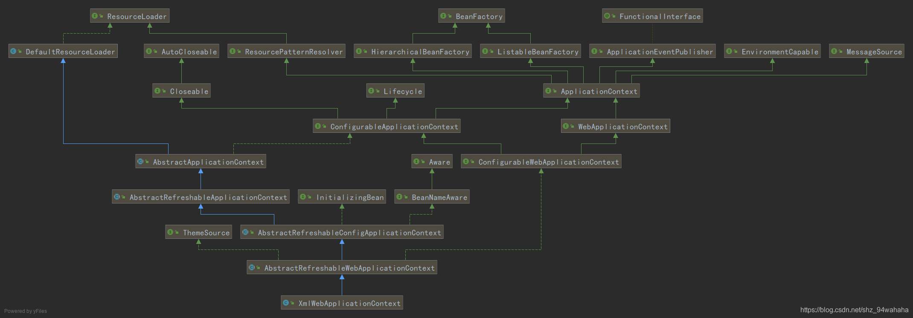
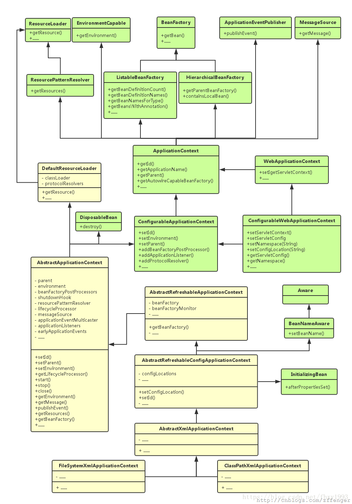

1.spring 入口ContextLoaderListener extends ContextLoader implements ServletContextListener,web.xml需要配置
执行contextInitialized
2.ContextLoader初始化好
WebApplicationContext extends ApplicationContext,实际初始化的是ContextLoader.properties(XmlWebApplicationContext)文件的配置??
应该是：ConfigurableWebApplicationContext
ConfigurableWebApplicationContext.refresh

3.引入概念：ApplicationContext
继承自BeanFactory接口，除了包含BeanFactory的所有功能之外，在国际化支持、资源访问（如URL和文件）、事件传播等方面进行了良好的支持

4.类图

5.ApplicationContext三大实现：ClassPathXmlApplicationContext FileSystemXmlApplicationContext XmlWebApplicationContext
    ApplicationContext ctx = new FileSystemXmlApplicationContext( "G:/Test/applicationcontext.xml ");
    
    ApplicationContext ctx = new ClassPathXmlApplicationContext( "/applicationcontext.xml ");
    
    ServletContext servletContext = request.getSession().getServletContext();
    ApplicationContext ctx = WebApplicationContextUtils.getWebApplicationContext(servletContext);

