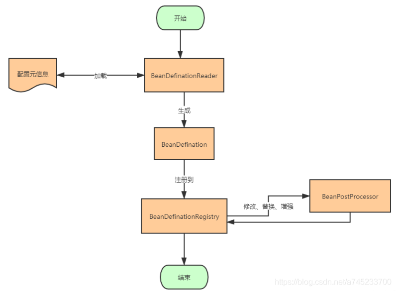
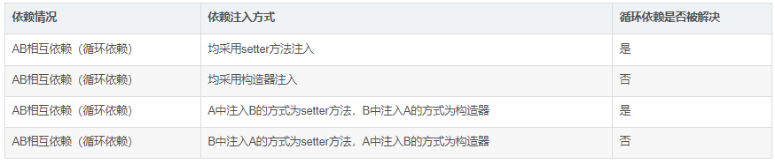

spring boot 源码：https://blog.csdn.net/m0_37298252/category_11543262.html

1.spring 入口ContextLoaderListener extends ContextLoader implements ServletContextListener,web.xml需要配置
执行contextInitialized
2.ContextLoader初始化好
WebApplicationContext extends ApplicationContext,实际初始化的是ContextLoader.properties(XmlWebApplicationContext)文件的配置??
应该是：ConfigurableWebApplicationContext
ConfigurableWebApplicationContext.refresh

3.引入概念：ApplicationContext
继承自BeanFactory接口，除了包含BeanFactory的所有功能之外，在国际化支持、资源访问（如URL和文件）、事件传播等方面进行了良好的支持

4.ApplicationContext类图

5.ApplicationContext三大实现：ClassPathXmlApplicationContext FileSystemXmlApplicationContext XmlWebApplicationContext
    ApplicationContext ctx = new FileSystemXmlApplicationContext( "G:/Test/applicationcontext.xml ");
    
    ApplicationContext ctx = new ClassPathXmlApplicationContext( "/applicationcontext.xml ");
    
    ServletContext servletContext = request.getSession().getServletContext();
    ApplicationContext ctx = WebApplicationContextUtils.getWebApplicationContext(servletContext);
6.Environment
是指应用环境的2个方面：profiles和properties。
源码：StandardServletEnvironment（超级父类AbstractEnvironment的doGetActiveProfiles），处理ConfigurablePropertyResolver

ConfigurableEnvironment是spring中非常重要的角色，可以通过它获得activeProfiles，
来判断我们所使用的环境是dev还是test或者prod等等。还可以根据getProperty拿到配置中的信息并且提供类型转换功能，以及获取系统环境变量等信息。

7.ApplicationContextInitializer-初始化ApplicationContext-从spring.factories获取
8.ApplicationListener-onApplicationEvent 监听ApplicationEvent事件-从spring.factories获取-可以自定义事件-监听器通过@Component注解进行实例化
    以Spring的内置事件ContextRefreshedEvent为例，当ApplicationContext被初始化或刷新时，会触发ContextRefreshedEvent事件
    ApplicationListener不是在SpringBoot项目中直接调用执行的，而是通过org.springframework.boot.context.event.EventPublishingRunListener implements SpringApplicationRunListener类中的成员SimpleApplicationEventMulticaster来反射执行的
9.EventPublishingRunListener   implements SpringApplicationRunListener

10.SpringApplicationRunListener
stating,environmentPrepared,contextPrepared等方法

11.spring 的广播
比如：EventPublishingRunListener implements SpringApplicationRunListener

EventPublishingRunListener将application的ApplicationListener托管给EventPublishingRunListener进行调用，
EventPublishingRunListener的广播进行循环判断ApplicationListener的事件

7.在何时判断当前是什么环境呢？
PropertySourcesPlaceholdersResolver ----
YamlPropertySourceLoader
PropertiesPropertySourceLoader

6.Aware 如
EnvironmentAware, ApplicationContextAware
在bean初始化过程中处理，判断不同的Aware进行不同的处理，在ApplicationContextAwareProcessor中实现
所以如果要自定义Aware必须写个BeanPostProcessor的实现（https://www.cnblogs.com/yanchuanbin/p/14582813.html）

类图：

源码：

7.BeanPostProcessor后置处理器
a.作用：作用是在Bean对象在实例化和依赖注入完毕后，在显示调用初始化方法的前后添加我们自己的逻辑
源码：
加载原理
8.BeanFactoryPostProcessor前置处理器
允许我们在实例化相应对象之前对注册到容器中的BeanDefinition的存储信息进行修改
源码：
9.spring 加载过程

10.bean的加载过程

11.SpringBootServletInitializer 几种加载方式

12.spring bean 加载过程

BeanDefinationReader
BeanDefination

BeanDefinationRegistry
BeanFactoryPostProcessor

1：实例化一个ApplicationContext的对象；
2：调用bean工厂后置处理器完成扫描；
3：循环解析扫描出来的类信息；
4：实例化一个BeanDefinition对象来存储解析出来的信息；
5：把实例化好的beanDefinition对象put到beanDefinitionMap当中缓存起来，以便后面实例化bean；
6：再次调用bean工厂后置处理器；
7：当然spring还会干很多事情，比如国际化，比如注册BeanPostProcessor等等，如果我们只关心如何实例化一个bean的话那么这一步就是spring调用finishBeanFactoryInitialization方法来实例化单例的bean，实例化之前spring要做验证，需要遍历所有扫描出来的类，依次判断这个bean是否Lazy，是否prototype，是否abstract等等；
8：如果验证完成spring在实例化一个bean之前需要推断构造方法，因为spring实例化对象是通过构造方法反射，故而需要知道用哪个构造方法；
9：推断完构造方法之后spring调用构造方法反射实例化一个对象；注意我这里说的是对象、对象、对象；这个时候对象已经实例化出来了，但是并不是一个完整的bean，最简单的体现是这个时候实例化出来的对象属性是没有注入，所以不是一个完整的bean；
10：spring处理合并后的beanDefinition;
11：判断是否支持循环依赖，如果支持则提前把一个工厂存入singletonFactories——map；
12：判断是否需要完成属性注入
13：如果需要完成属性注入，则开始注入属性
14：判断bean的类型回调Aware接口
15：调用生命周期回调方法
16：如果需要代理则完成代理
17：put到单例池——bean完成——存在spring容器当中

13.spring bean 生命周期

14.spring如何解决循环引用-三级缓存
与此同时，我们应该知道，Spring在创建Bean的过程中分为三步

实例化，对应方法：AbstractAutowireCapableBeanFactory中的createBeanInstance方法
属性注入，对应方法：AbstractAutowireCapableBeanFactory的populateBean方法
初始化，对应方法：AbstractAutowireCapableBeanFactory的initializeBean

Spring通过三级缓存解决了循环依赖，
其中一级缓存为单例池（singletonObjects）,
二级缓存为早期曝光对象earlySingletonObjects，
三级缓存为早期曝光对象工厂（singletonFactories）。
当A、B两个类发生循环引用时，在A完成实例化后，就使用实例化后的对象去创建一个对象工厂，并添加到三级缓存中，
如果A被AOP代理，那么通过这个工厂获取到的就是A代理后的对象，如果A没有被AOP代理，那么这个工厂获取到的就是A实例化的对象。
当A进行属性注入时，会去创建B，同时B又依赖了A，所以创建B的同时又会去调用getBean(a)来获取需要的依赖，此时的getBean(a)会从缓存中获取，
第一步，先获取到三级缓存中的工厂；第二步，调用对象工工厂的getObject方法来获取到对应的对象，得到这个对象后将其注入到B中。紧接着B会走完它的生命周期流程，
包括初始化、后置处理器等。当B创建完后，会将B再注入到A中，此时A再完成它的整个生命周期。至此，循环依赖结束！

面试官：”为什么要使用三级缓存呢？二级缓存能解决循环依赖吗？“

答：如果要使用二级缓存解决循环依赖，意味着所有Bean在实例化后就要完成AOP代理，这样违背了Spring设计的原则，
Spring在设计之初就是通过AnnotationAwareAspectJAutoProxyCreator这个后置处理器来在Bean生命周期的最后一步来完成AOP代理，而不是在实例化后就立马进行AOP代理。

