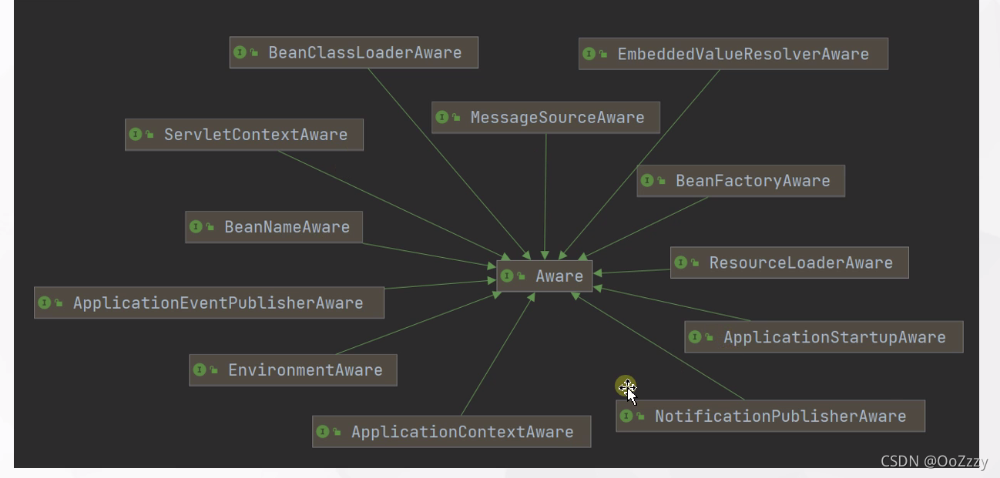

spring boot 源码：https://blog.csdn.net/m0_37298252/category_11543262.html

1.spring 入口ContextLoaderListener extends ContextLoader implements ServletContextListener,web.xml需要配置
执行contextInitialized
2.ContextLoader初始化好
WebApplicationContext extends ApplicationContext,实际初始化的是ContextLoader.properties(XmlWebApplicationContext)文件的配置??
应该是：ConfigurableWebApplicationContext
ConfigurableWebApplicationContext.refresh

3.引入概念：ApplicationContext
继承自BeanFactory接口，除了包含BeanFactory的所有功能之外，在国际化支持、资源访问（如URL和文件）、事件传播等方面进行了良好的支持

4.ApplicationContext类图

5.ApplicationContext三大实现：ClassPathXmlApplicationContext FileSystemXmlApplicationContext XmlWebApplicationContext
    ApplicationContext ctx = new FileSystemXmlApplicationContext( "G:/Test/applicationcontext.xml ");
    
    ApplicationContext ctx = new ClassPathXmlApplicationContext( "/applicationcontext.xml ");
    
    ServletContext servletContext = request.getSession().getServletContext();
    ApplicationContext ctx = WebApplicationContextUtils.getWebApplicationContext(servletContext);
6.Environment
是指应用环境的2个方面：profiles和properties。
源码：StandardServletEnvironment（超级父类AbstractEnvironment的doGetActiveProfiles），处理ConfigurablePropertyResolver

ConfigurableEnvironment是spring中非常重要的角色，可以通过它获得activeProfiles，
来判断我们所使用的环境是dev还是test或者prod等等。还可以根据getProperty拿到配置中的信息并且提供类型转换功能，以及获取系统环境变量等信息。

7.ApplicationContextInitializer-初始化ApplicationContext-从spring.factories获取
8.ApplicationListener-onApplicationEvent 监听ApplicationEvent事件-从spring.factories获取-可以自定义事件-监听器通过@Component注解进行实例化
    以Spring的内置事件ContextRefreshedEvent为例，当ApplicationContext被初始化或刷新时，会触发ContextRefreshedEvent事件
    ApplicationListener不是在SpringBoot项目中直接调用执行的，而是通过org.springframework.boot.context.event.EventPublishingRunListener implements SpringApplicationRunListener类中的成员SimpleApplicationEventMulticaster来反射执行的
9.EventPublishingRunListener   implements SpringApplicationRunListener

10.SpringApplicationRunListener
stating,environmentPrepared,contextPrepared等方法

11.spring 的广播
比如：EventPublishingRunListener implements SpringApplicationRunListener

EventPublishingRunListener将application的ApplicationListener托管给EventPublishingRunListener进行调用，
EventPublishingRunListener的广播进行循环判断ApplicationListener的事件

7.在何时判断当前是什么环境呢？
PropertySourcesPlaceholdersResolver ----
YamlPropertySourceLoader
PropertiesPropertySourceLoader

6.Aware 如
EnvironmentAware, ApplicationContextAware
在bean初始化过程中处理，判断不同的Aware进行不同的处理，在ApplicationContextAwareProcessor中实现
所以如果要自定义Aware必须写个BeanPostProcessor的实现（https://www.cnblogs.com/yanchuanbin/p/14582813.html）

类图：

源码：

7.BeanPostProcessor后置处理器
a.作用：作用是在Bean对象在实例化和依赖注入完毕后，在显示调用初始化方法的前后添加我们自己的逻辑
源码：

8.BeanFactoryPostProcessor前置处理器
允许我们在实例化相应对象之前对注册到容器中的BeanDefinition的存储信息进行修改
源码：
9.spring 加载过程

10.bean的加载过程

11.SpringBootServletInitializer 几种加载方式

