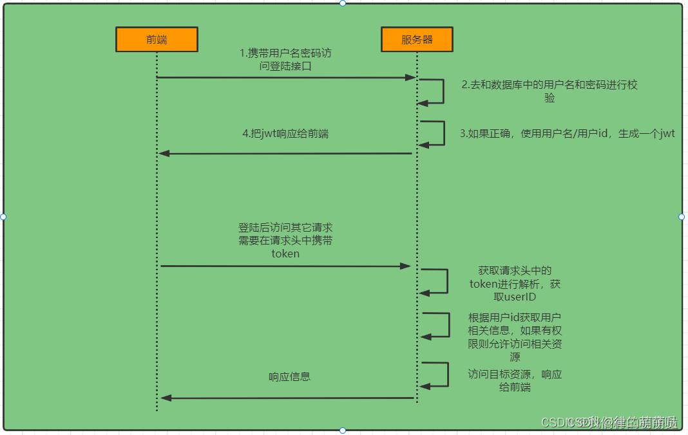
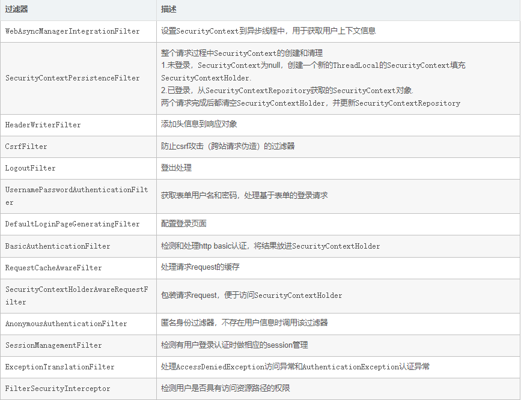

一、介绍
一般来说中大型的项目都是使用SpringSecurity来做安全框架。小项目有Shiro的比较多，因为相比与SpringSecurity，Shiro的上手更加的简单。
​ 一般Web应用的需要进行认证和授权。
认证：验证当前访问系统的是不是本系统的用户，并且要确认具体是哪个用户
​ 授权：经过认证后判断当前用户是否有权限进行某个操作
​ 而认证和授权也是SpringSecurity作为安全框架的核心功能。
二、登录认证

三、原理
SpringSecurity的原理其实就是一个过滤器链，内部包含了提供各种功能的过滤器

UsernamePasswordAuthenticationFilter:负责处理我们在登陆页面填写了用户名密码后的登陆请求。入门案例的认证工作主要有它负责。
ExceptionTranslationFilter：处理过滤器链中抛出的任何AccessDeniedException和AuthenticationException。
FilterSecurityInterceptor：负责权限校验的过滤器。
四、WebSecurityConfigurerAdapter:自定义Security策略.
Security配置必须实现这个类
五、各个过滤器介绍

