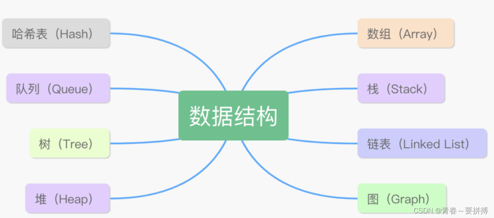

https://blog.csdn.net/weixin_42672802/article/details/122159386
一、java常用8大数据结构

1.数组
优点：
    按照索引查询速度很快；
    按照索引遍历数组也很方便。
缺点：
    数组的大小在创建后就确定了，无法扩容；
    数组只能存储一种类型的数据；

添加、删除元素的操作很耗时间，因为要移动其他元素。
2.链表-内存非连续的
    指向一个结点（node）的引用，该节点还有一个元素和一个指向另一条链表的引用。
    Java 的 LinkedList 类可以很形象地通过代码的形式来表示一个链表的结构：
    //这是一种双向链表，当前元素 item 既有 prev 又有 next，不过 first 的 prev 为 null，
    //last 的 next 为 null。如果是单向链表的话，就只有 next，没有 prev。
    public class LinkedList<E> {
        transient Node<E> first;
        transient Node<E> last;
     
        private static class Node<E> {
            E item;
            Node<E> next;
            Node<E> prev;
     
            Node(Node<E> prev, E element, Node<E> next) {
                this.item = element;
                this.next = next;
                this.prev = prev;
            }
        }
    }
优点：
    不需要初始化容量；
    插入和删除快,砍断连接,更新引用；
    查询慢,需要遍历整个链表。
缺点：
    含有大量的引用，占用的内存空间大；
    查找元素需要遍历整个链表，耗时。    
3.栈
    栈按照“后进先出”、“先进后出”的原则来存储数据，先插入的数据被压入栈底，后插入的数据在栈顶，读出数据的时候，从栈顶开始依次读出。
4.队列
    先进线出
5.树
    每个节点都只有有限个子节点或无子节点；
    没有父节点的节点称为根节点；
    每一个非根节点有且只有一个父节点；
    除了根节点外，每个子节点可以分为多个不相交的子树。
树的分类:二叉查找树,平衡二叉树(AVL树),B-Tree,B+Tree,红黑树 
6.堆
堆可以被看做是一棵树的数组对象，具有以下特点：
堆中某个节点的值总是不大于或不小于其父节点的值；
堆总是一棵完全二叉树。
7.图
8.哈希表
也叫散列表，是一种可以通过关键码值（key-value）直接访问的数据结构，它最大的特点就是可以快速实现查找、插入和删除。

数组的最大特点就是查找容易，插入和删除困难；而链表正好相反，查找困难，而插入和删除容易。哈希表很完美地结合了两者的优点， Java 的 HashMap 在此基础上还加入了树的优点。
