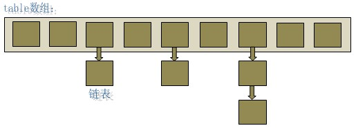

一、hashmap
 transient Node<K,V>[] table;
 HashMap实际上是一个“链表散列”的数据结构，即数组和链表的结合体。
 
 
 
 
 首先我们从数据结构的角度来看：HashMap是:数组+链表+红黑树（JDK1.8增加了红黑树部分链表长度>8变红黑树,<6变链表）的数据结构，如下所示:

 
默认初始容量(数组默认大小):16，2的整数次方

HashMap 何时扩容？put的元素达到容量乘负载因子的时候，默认16*0.75

二、CurrentHashMap

ConcurrentHashMap的设计与实现非常精巧，大量的利用了volatile，final，CAS等lock-free技术来减少锁竞争对于性能的影响。

JDK1.7：Segment(分段锁)-减少锁的粒度

采用了数组+链表+红黑树的实现方式来设计，内部大量采用CAS操作，这里我简要介绍下CAS。

CAS 操作包含三个操作数 —— 内存位置（V）、预期原值（A）和新值(B)。如果内存地址里面的值和A的值是一样的，那么就将内存里面的值更新成B。CAS是通过无限循环来获取数据的，如果在第一轮循环中，a线程获取地址里面的值被b线程修改了，那么a线程需要自旋，到下次循环才有可能机会执行。

