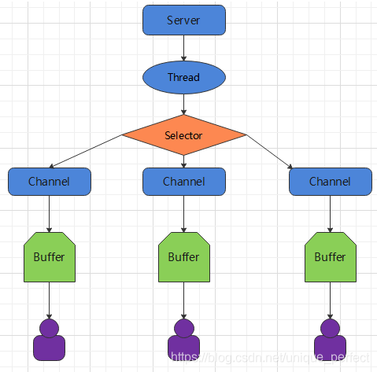
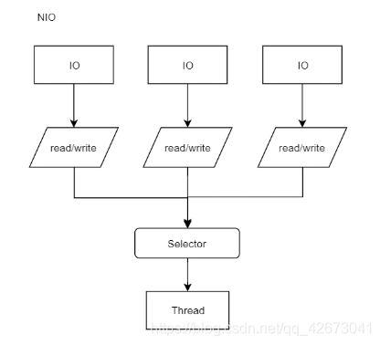

参考：https://blog.csdn.net/K_520_W/article/details/123454627
一、简介

NIO有三大核心部分: Channel(通道)，Buffer(缓冲区)，Selector(选择器)

Buffer(缓冲区)

        缓冲区本质上是一块可以写入数据，然后可以从中读取数据的内存。这块内存被包装成NIO Buffer对象，并提供了一组方法，用来方便的访问该块内存。相比较直接对数组的操作，Buffer APl更加容易操作和管理。

Channel(通道)

        Java NIO的通道类似流，但又有些不同:既可以从通道中读取数据，又可以写数据到通道。但流的(input或output)读写通常是单向的。通道可以非阻塞读取和写入通道，通道可以支持读取或写入缓冲区，也支持异步地读写。

Selector(选择器)

        Selector是一个ava NIO组件，可以能够检查一个或多个NIO通道，并确定哪些通道已经准备好进行读取或写入。这样，一个单独的线程可以管理多个channel，从而管理多个网络连接，提高效率

二、选择器(Selector)

1.选择器（Selector)是SelectableChannle对象的多路复用器，Selector可以同时监控多个SelectableChannel的IO状况，也就是说，利用Selector可使一个单独的线程管理多个Channel。Selector是非阻塞IO的核心。

Java 的 NIO，用非阻塞的 IO 方式。可以用一个线程，处理多个的客户端连接，就会使用到 Selector(选择器)
Selector 能够检测多个注册的通道上是否有事件发生(注意:多个 Channel 以事件的方式可以注册到同一个(Selector)，如果有事件发生，便获取事件然后针对每个事件进行相应的处理。这样就可以只用一个单线程去管
理多个通道，也就是管理多个连接和请求。
只有在连接/通道真正有读写事件发生时，才会进行读写，就大大地减少了系统开销，并且不必为每个连接都创建一个线程，不用去维护多个线程
避免了多线程之间的上下文切换导致的开销
2.API
//1. 获取通道
ServerSocketChannel ssChannel = ServerSocketChannel.open();
//2. 切换非阻塞模式
ssChannel.configureBlocking(false);
//3. 绑定连接
ssChannel.bind(new InetSocketAddress(9898));
//4. 获取选择器
Selector selector = Selector.open();
//5. 将通道注册到选择器上, 并且指定“监听接收事件”
ssChannel.register(selector, SelectionKey.OP_ACCEPT);

SelectionKey :
读 : SelectionKey.OP_READ （1）
写 : SelectionKey.OP_WRITE （4）
连接 : SelectionKey.OP_CONNECT （8）
接收 : SelectionKey.OP_ACCEPT （16）
若注册时不止监听一个事件，则可以使用“位或”操作符连接。
int interestSet = SelectionKey.OP_READ|SelectionKey.OP_WRITE
3.NIO非阻塞式网络通信原理分析

二、同步与阻塞

同步阻塞。当执行者要执行由A-B-C三件事情组成的DEMO，当A执行完之后调用B，B执行完成之后在调用C，最终此事件完成。这种A执行完之后调用下一件事的动作就是同步。而执行者等待这个DEMO的完成的动作则是阻塞。

而什么是同步非阻塞呢？总事物还是按照原计划执行，但是执行者会在DEMO完成期间去做别的事件，但是它会监听此DEMO是否执行完成。如果完成，又会切换回来完成之后的事件。切换的动作就是非阻塞了。

说完前两个，肯定要说说异步非阻塞了。异步与同步的区别在于，同步切换的动作是当执行者监听到DEMO完成，再切换。而异步则是当DEMO完成之后会发出完成的广播，通知执行者，然后执行者按照自己的计划去切换

它们在日常中分别叫做

BIO - BlockingIO 同步阻塞

NIO - Non-Blocking IO 同步非阻塞

AIO - Asynchronous IO 异步非阻塞
NIO最基础的使用模型为多路复用模型。
效果图:

